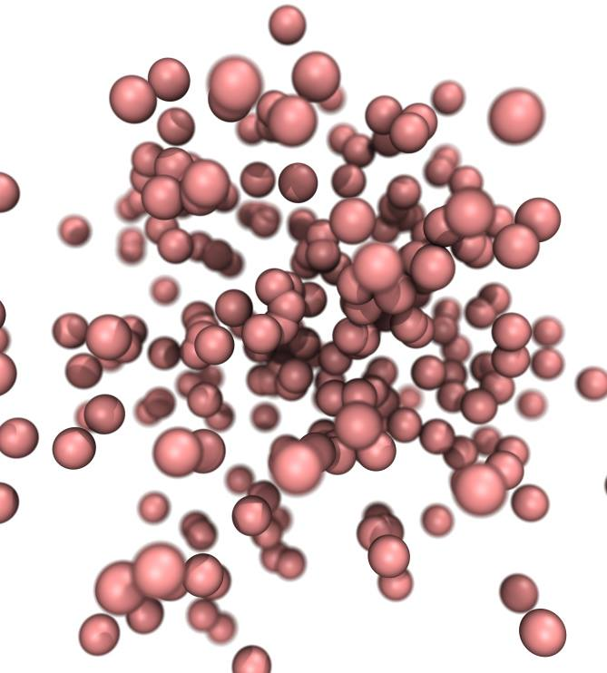

# Random Walk Molecular Simulation
This project is a molecular simulation with reaction model
using Random Walk algorithm. It was made as an assignment for the advanced numerical methods course.
## Getting started
### Prerequisites
* Python version >= 3.4
* Numpy module 
### Running the program
To run the program you have to import this package `from randmol import RunProgram`
and then create a `RunProgram` object object with argument `numofiter > 0`,
i.e. `simulation = RunProgram(numofiter=5000, numofmols=20, outputname='default.xyz')`. 
After that you should call the method `runsim()` to start the simulation, i.e. `simulation.runsim()`
## Input arguments
There is several arguments which are explained below:

`numseed [int]` [default is 0] - Seed for random number generator.

`numofiter [int]` [default is 0] - Random walk algorithm number of iterations.

`maxmov [int]` [default is 2] - Maximum length in angstroms which a molecule can be translated in one random walk iteration.

`numofmols [int]` [default is 5] - Number of molecules in the simulation.

`boxsize [tuple]` [default is (30, 30, 30)] - Size of 3D periodic boundary condition box in angstroms.

`bondformprob [float]` [default is 0.5] - Probability of forming a bond during one random walk iteration.

`bondbreakprob [float]` [default is 0.1] - Probability of breaking a bond during one random walk iteration.

`bondlenform [int]` [default is 2] - Length of bond after forming bond between two molecules.

`outputname [string]` [default is default.xyz] - Outputname for molecular trajectory in XYZ format.

## Output
Output is xyz file which can be visualized by free software like VMD or Molden.
Example of 240 atom simulation, visualised with VMD.

